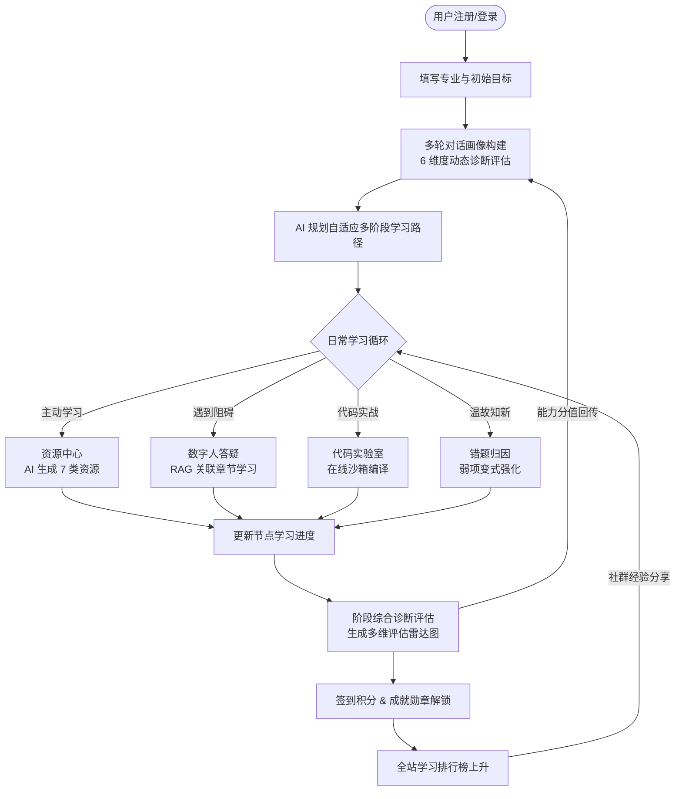

# 🎓 Kowell AI — 基于多智能体的AIGC资源生成与学习助手

         

---

## 📋 项目简介


**Kowell AI** 一款面向学生和教师的多智能体个性化智能学习助手。平台依托多模态AI大模型、数据可视化、多智能体协作技术，聚焦人工智能、电子信息等专业，提供“画像构建-资源生成-路径规划-学习辅导-效果评估”完整Agent 闭环个性化学习服务，助力学生提升学习效率、优化资源利用。

### 🌟 核心亮点

| 亮点 | 描述 |
| :--- | :--- |
| 🤖 **多模型 AI 对接层** | 独立封装 DeepSeek-V4-Flash、MiniMax-M3、阶跃 StepAudio、Kling 视频生成、MiniMax-TTS 等多种大模型服务，支持流式 SSE 与非流式两种模式 |
| 🔄 **动态学习闭环与 Agent 编排** | 支持 Multi-Agent 工作流编排（`agent_runs` / 租约状态机）、课程知识库检索、学习事件同事务更新及非阻塞 AI 评估判分 |
| 🎨 **拟物手风琴交互** | 首页「六大核心特色功能」采用硬件加速的 CSS Flex 变宽手风琴卡片，悬停即自动展开，过渡丝滑 |
| 🗂️ **资源一站式 CRUD** | 「AI 资源生成」页面内置「我的资源」管理抽屉，暗色玻璃拟态分栏支持检索、预览、编辑及增删改查 |
| 🕸️ **3D 知识图谱** | 基于 Three.js 力导向布局渲染，节点可旋转、拖拽、双击跳转关联资源 |
| 🔐 **完整 Supabase 权限体系** | 内置 Auth 鉴权与 RLS 行级安全策略，保障用户数据安全合规 |
| 📱 **响应式双端布局** | 桌面端抽屉式侧边栏 + 3D 浮动面板；移动端手风琴自动转为纵向弹性堆叠 |
| 💳 **微信支付 & 订阅套餐** | 内置完整订单创建、微信支付回调与套餐权益控制 |

---

## 🛠️ 技术栈

### 💻 前端技术

| 技术/框架 | 版本 | 用途/核心功能 |
| :--- | :--- | :--- |
| **React** | 18.x | 声明式组件化开发框架，并发渲染 |
| **TypeScript** | 5.x | 全链路静态类型校验，减少运行时隐患 |
| **Vite (Rolldown)** | latest | 毫秒级 HMR 热更新，基于 Rolldown 引擎高速打包 |
| **React Router** | 7.x | SPA 路由，支持 Lazy 异步按需加载 |
| **Zustand** | 5.x | 轻量级全局状态管理，使用 `persist` 中间件实现本地持久化 |
| **Tailwind CSS** | 3.x | 原子化样式系统，结合 CSS 变量切换深浅色主题 |
| **Framer Motion** | 12.x | 页面转场、手风琴缩放微动效以及浮动元素弹性动效 |
| **Radix UI / Shadcn** | - | 50+ 无头 UI 组件二次封装（按钮、对话框、下拉框、表格等） |
| **Recharts** | 2.15.x | 渲染学习曲线、综合评估雷达图等数据看板 |
| **Three.js** | 0.184.x | 3D 渲染，知识图谱交互式节点漫游 |
| **eventsource-parser** | 3.x | AI 接口 SSE 流式数据实时解析 |
| **docx / pptxgenjs** | - | 前端一键导出标准 Word、PowerPoint 课件 |
| **react-hook-form + zod** | - | 表单状态管理与 Schema 校验 |
| **Biome** | 2.4.x | 代码格式化与 Lint，保障风格一致性 |

### ☁️ 后端与数据层

| 技术/框架 | 用途/核心功能 |
| :--- | :--- |
| **Supabase BaaS** | 托管 PostgreSQL 数据库，自动生成 REST APIs，支持实时订阅 |
| **Supabase Edge Functions** | 15 个 Deno 无服务器云函数，承载 AI 对接、Agent 编排、动态路径自适应、微信支付、TTS 等安全业务 |
| **GoTrue Auth** | 用户注册、邮箱验证、会话管理及密码重置 |
| **Supabase Storage** | 头像、课件、思维导图等非结构化媒介存储分发，支持加密防盗链 |
| **Database Migrations** | 13 个版本化 SQL 迁移脚本，同步表结构、触发器、RPC 函数及 RLS 策略 |
| **Row Level Security (RLS)** | 行级安全策略，确保用户仅能访问自有数据 |

### 🤖 AI 服务层

| 服务名称 | 调用方式 | 用途/核心功能 |
| :--- | :--- | :--- |
| **DeepSeek-V4-Flash** | 前端直连（代理 https://ai.dxkp.com/v1） + Edge Function | 文本对话、代码审查、答疑、画像构建、资源生成，支持 SSE 流式输出 |
| **MiniMax-M3** | Edge Function 网关调用 | 通用对话、资源生成、智能评估，含主模型降级到 `ernie-speed` |
| **阶跃 StepAudio** | 前端代理 `/api/stepaudio` | 语音对话与音频理解，支持实时语音交互 |
| **MiniMax TTS** | Edge Function `minimax-tts` | 文本转语音合成，数字人讲解配音 |
| **Kling (可灵) 视频** | Edge Function `kling-video-create/query` | 数字人讲解视频生成与状态轮询 |
| **Gmicloud Seedance** | 前端代理 `/api/gmicloud` | 视频生成模型服务 |
| **图像生成** | Edge Function `image-generations` | AI 配图与可视化素材生成 |
| **Web Reader** | Edge Function `web-reader` | 在线网页内容抓取，辅助 RAG 检索 |

---

## 📁 目录结构

```text
Kowell AI/
├── docs/                            # 产品文档与素材
│   ├── prd/                         # 产品需求文档（prd.md / prd1.md）
│   ├── cool/ ok/ ppt/               # 演示文档与场景剧本
├── kowell-ai-proposal/              # 项目立项提案 HTML 静态页
├── public/                          # 静态资源
│   ├── images/features/             # 六大功能模块配图
│   ├── images/logo/                 # 品牌图标（亮/暗/icon）
│   └── images/error/                # 404/500/503 错误页 SVG
├── src/
│   ├── components/
│   │   ├── ai/AIChatPanel.tsx       # 通用 AI 对话面板（流式 SSE）
│   │   ├── common/                  # 全局通用组件
│   │   │   ├── CheckInWidget.tsx    # 每日签到打卡挂件
│   │   │   ├── ErrorBoundary.tsx    # 全局异常捕获
│   │   │   ├── GlobalSearch.tsx     # 全局知识检索
│   │   │   ├── NotificationBell.tsx # 站内通知铃铛
│   │   │   └── RouteGuard.tsx       # SPA 路由守卫
│   │   ├── layouts/AppLayout.tsx    # 主布局（侧栏+顶栏+面包屑）
│   │   ├── tutoring/                # 数字人答疑专属组件
│   │   ├── voice/VoiceCallModal.tsx # 仿通话语音聊天弹窗
│   │   └── ui/                      # 50+ Radix/Shadcn 风格原子组件
│   ├── contexts/AuthContext.tsx     # 用户账户状态 Context
│   ├── db/supabase.ts               # Supabase 客户端初始化
│   ├── hooks/                       # 自定义 Hooks（防抖/上传/移动端检测）
│   ├── lib/                         # 工具库（utils、ai 汇总）
│   ├── pages/                       # 29 个核心业务页面
│   ├── services/ai/                 # 🤖 AI 服务对接层
│   │   ├── config.ts                # AI 密钥与代理地址
│   │   ├── deepseek.ts              # DeepSeek 对接（流式/非流式）
│   │   ├── text/service.ts          # 文本生成服务
│   │   ├── vision/service.ts        # 视觉理解服务
│   │   ├── video/service.ts         # 视频生成服务
│   │   └── stepaudio/               # 阶跃语音服务
│   ├── store/useAppStore.ts         # Zustand 全局 Store
│   ├── types/                       # 业务实体 TypeScript 类型
│   ├── App.tsx                      # 根组件（路由+Provider+Toast）
│   ├── routes.tsx                   # 25 条路由配置（Lazy 加载）
│   └── index.css                    # Tailwind 全局样式与动画
├── supabase/
│   ├── functions/                   # 15 个 Deno Edge Functions
│   │   ├── _shared/                 # 共享模块 (agent-runtime, content-safety, knowledge-retrieval 等)
│   │   ├── agent-orchestrate/       # 多智能体资源编排与工作流运行时
│   │   ├── learning-adapt/          # 动态学习闭环与路径自适应
│   │   ├── ai-chat/                 # AI 对话（含滑动窗口+模型降级）
│   │   ├── ai-generate/             # 5 类学习资源生成
│   │   ├── ai-evaluate/             # 智能评分与反馈
│   │   ├── ai-recommend/            # 个性化推荐
│   │   ├── image-generations/       # 图像生成
│   │   ├── kling-video-create/      # 可灵视频创建
│   │   ├── kling-video-query/       # 可灵视频状态查询
│   │   ├── minimax-tts/             # MiniMax 文本转语音
│   │   ├── web-reader/              # 网页内容抓取
│   │   ├── create-payment-order/    # 微信支付订单创建
│   │   ├── wechat-payment-webhook/  # 微信支付回调
│   │   └── admin-setup/             # 管理员初始化
│   ├── migrations/                  # 13 个版本化数据库迁移脚本
│   └── schema.sql                   # 数据库最新 Schema 镜像
├── .rules/                          # 代码规范 YAML 检测规则
├── package.json                     # 依赖声明（79 生产 + 16 开发）
├── vite.config.ts / vite.config.dev.ts  # 构建与代理配置
├── tailwind.config.js               # Tailwind 主题扩展
├── biome.json                       # Biome Lint 规则
└── tsconfig.json                    # TypeScript 编译配置
```

---

## ⚡ 核心功能模块和工作流程

### 🗺️ 系统功能脑图

```text
Kowell AI 学习平台
├── 🏠 公共页面
│   ├── /                       官网营销展示页（手风琴六大特色模块）
│   ├── /home                   控制台首页（打卡挂件、今日推荐、进度大盘）
│   └── /login                  用户凭证认证（登录/注册/找回密码）
├── 👤 画像与个人中心
│   ├── /profile                修改基础资料、订阅套餐信息
│   └── /portrait               苏格拉底多轮问答画像构建，支持语音交互
├── 📚 智能资源体系
│   ├── /resources              资源库首页（按生成分类筛选）
│   ├── /resources/generate     AI 资源生成核心看板（含「我的资源」CRUD 抽屉）
│   └── /resources/:id/edit     富文本资源编辑器
├── 🎯 学习与强化路径
│   ├── /learning-path          阶段自适应路线图（树状节点追踪）
│   ├── /tutoring               智能数字人答疑（多模态输入、生成讲解视频）
│   ├── /evaluation             阶段性诊断测试与多维评估图表
│   └── /weakness-training      基于错题分类的多级变式题弱项特训
├── 🧰 学习辅助工具
│   ├── /todos                  每日任务清单（看板拖拽 + 优先级）
│   ├── /notes                  全功能富文本笔记管理
│   ├── /wrong-book             智能归纳错因的个人错题本
│   ├── /knowledge-graph        Three.js 交互式 3D 课程图谱
│   ├── /code-lab               多语言在线沙箱（代码高亮 + AI Review）
│   ├── /agent-viz              多智能体协作可视化
│   ├── /strategy               产品可视化与战略对比
│   └── /report                 周/月度学业报告与 AI 教练总结
└── 🏆 游戏化与付费体系
    ├── /badges                 成就勋章墙（4 类稀有度判定）
    ├── /leaderboard            全站打卡积分/时长光荣榜
    ├── /community              学习社群（发帖、共享、点赞）
    ├── /invite                 邀请有礼返积分系统
    └── /order/:orderId         订单状态支付跟踪
```

### 🔄 核心学习闭环流程



### 🧩 核心子模块工作流

#### 1. 🧠 画像构建工作流
1. 用户进入 `/portrait` 触发对话，支持语音输入。
2. 调度 `ai-chat` Edge Function（参数 `prompt_type=portrait`），AI 基于苏格拉底提问策略进行 5-6 轮引导。
3. 收集用户对技术经验、认知习惯和学习目标的自然语言描述。
4. 对话结束时 AI 后台以 strict JSON 模式提炼包含六大维度得分的 profile 报告，自动更新至 `learning_portraits` 表，并重算关联学习路径。

#### 2. 📖 智能资源生成与管理 (CRUD) 工作流
1. 用户在 `/resources/generate` 输入学科方向与生成大纲。
2. 调用 `ai-generate` 云函数，根据 `resource_type`（document / mindmap / exercise / reading / code）并行拉起对应流式工作流。
3. **「我的资源」管理抽屉**：
   - **C 创建**：手动新建教学资源并关联课程
   - **R 读取**：查看大纲、富文本内容、已读状态
   - **U 修改**：在线编辑标题、正文、备注
   - **D 删除**：彻底移除或软删除

#### 3. 🕸️ 三维知识图谱工作流
1. 后端对教材大纲提取，整理为 `source / target / weight` 图关系 JSON。
2. 前端引入 Three.js，通过力导向布局算法渲染 3D 节点球体与关联线条。
3. 用户可在三维空间中旋转、拖拽节点，双击节点即可关联打开 AI 资源大纲或启动答疑。

#### 4. 💳 微信支付与订阅工作流
1. 用户在 `/invite` 或套餐页选择订阅方案 → 调用 `create-payment-order` 创建订单。
2. 拉起微信扫码支付，支付成功后微信回调 `wechat-payment-webhook`。
3. Webhook 验签后更新订单状态，并回写 `user_profiles` 的套餐等级与权益字段。

---

## ⚙️ 部署指南

### 📋 环境要求

| 依赖 | 版本 | 说明 |
| :--- | :--- | :--- |
| **Node.js** | v20.x+ | 推荐 LTS 版本 |
| **pnpm** | v9.x+ | 推荐使用以提升安装速度（也可用 npm v10+） |
| **Supabase CLI** | latest | 用于本地 Edge Functions 调试与数据库推送（可选） |

### 🚀 本地开发步骤

#### Step 1 — 安装依赖

```bash
cd "Kowell AI"
pnpm install   # 或 npm install
```

#### Step 2 — 配置环境变量 `.env`

在项目根目录新建 `.env` 文件：

```env
# Supabase 配置
VITE_SUPABASE_URL=https://your-project.supabase.co
VITE_SUPABASE_ANON_KEY=eyJhbGciOiJIUzI1NiIsInR5cCI6IkpXVCJ9...

# DeepSeek-V4-Flash 配置（通过代理服务端访问 https://ai.dxkp.com/v1）
DEEPSEEK_API_KEY=sk-xpFW-5LiEZ20VU9711CVJEbztoowzt5

# 阶跃 StepAudio（可选）
STEP_API_KEY=your_step_api_key

# Gmicloud Seedance 视频（可选）
SEEDANCE_API_KEY=your_seedance_api_key
```

#### Step 3 — 初始化 Supabase 数据库

打开 Supabase 控制台 SQL Editor，按文件名序号依次执行 `supabase/migrations/` 下的 13 个迁移脚本：

| 序号 | 文件名 | 作用 |
| :--- | :--- | :--- |
| 1 | `00001_create_all_tables.sql` | 基础表结构定义 |
| 2 | `00002_add_enhancement_tables_and_columns.sql` | 扩展资源字段 |
| 3 | `00003_pa_new_features_tables.sql` | 用户画像专属扩展表 |
| 4 | `00004_fix_auth_trigger_and_rls.sql` | 修复注册自动创建 Profile 触发器 |
| 5 | `00005_add_role_to_user_profiles.sql` | 加入角色控制字段 |
| 6 | `00006_invite_points_plans.sql` | 邀请人积分机制 |
| 7 | `00007_create_payment_tables.sql` | 付费套餐订单表 |
| 8 | `00008_add_plan_fields_to_user_profiles.sql` | 完善用户套餐权益 |
| 9 | `00009_exercise_types_and_ai_status.sql` | 扩展习题类型与非阻塞 AI 判分状态 |
| 10 | `00010_ai_course_knowledge_base.sql` | AI 课程知识库、文档分块与全文检索 |
| 11 | `00011_agent_workflow_runtime.sql` | Agent 工作流运行时表与租约状态机 |
| 12 | `00012_dynamic_learning_loop.sql` | 动态学习闭环、能力掌握度与同事务自适应 |
| 13 | `00013_a3_runtime_consistency.sql` | 运行时一致性约束与 SECURITY DEFINER RPC 函数 |
| 14 | `00014_fix_courses_rls_policy.sql` | 允许用户创建/更新课程并修复 RLS 权限策略 |

#### Step 4 — 配置 Edge Functions Secrets

```bash
supabase secrets set INTEGRATIONS_API_KEY=your_minimax_gateway_key
supabase secrets set SUPABASE_SERVICE_ROLE_KEY=your_service_role_key
```

#### Step 5 — 启动开发服务器

```bash
pnpm dev   # 或 npm run dev
```

访问 `http://localhost:5173` 即可。

### 🏗️ 生产环境构建与部署

```bash
# 类型检查 + Lint
pnpm lint

# 构建生产静态包
pnpm build
```

构建产物输出到 `dist/`，可托管至：

- **Nginx 容器**：需配置 `try_files $uri $uri/ /index.html;` 解决 SPA 路由刷新 404
- **CDN 静态托管**：阿里 OSS、腾讯 COS、Vercel、Netlify 等直接上传 `dist/` 即可

#### Nginx 参考配置

```nginx
server {
    listen 80;
    location / {
        root /usr/share/nginx/html;
        index index.html;
        try_files $uri $uri/ /index.html;
    }
}
```

---

## 📦 API 接口

### 🔑 核心数据库表

| 物理表名 | 存储内容 | 核心关联 |
| :--- | :--- | :--- |
| `user_profiles` | 用户资料、等级、积分、连续打卡天数、套餐权益 | 主键 `id` → `auth.users.id` |
| `learning_portraits` | 用户 6 维学习画像 JSON | `user_id` → `user_profiles.id` |
| `courses` | 课程元信息（名称、专业分类、章节大纲） | 主键 `id` |
| `resources` | 学习资源（多版本、富文本、已读状态） | `course_id` → `courses.id` |
| `wrong_book_entries` | 错题记录与错因标签 | `user_id` + `exercise_id` |
| `daily_todos` | 每日打卡代办任务清单 | `user_id` |
| `user_check_ins` | 每日打卡流水（连续签到校验） | `user_id` |

### ☁️ Supabase Edge Functions 接口

| 函数名 | 方法 | 功能描述 | 关键参数 |
| :--- | :--- | :--- | :--- |
| `agent-orchestrate` | POST | 多智能体资源编排与工作流执行 | `agent_run_id`, `step_keys` |
| `learning-adapt` | POST | 动态学习闭环与自适应路径更新 | `user_id`, `event_type`, `payload` |
| `ai-chat` | POST | AI 对话（含滑动窗口+模型降级），支持流式 | `messages`, `prompt_type`, `stream` |
| `ai-generate` | POST | 生成 5 类学习资源（文档/思维导图/习题/阅读/代码） | `course_name`, `topic`, `resource_type` |
| `ai-evaluate` | POST | 智能评分与反馈，输出 JSON | 题目、标准答案、学生答案 |
| `ai-recommend` | POST | 个性化学习内容推荐 | 用户画像上下文 |
| `image-generations` | POST | AI 图像生成 | `prompt`, `size` |
| `kling-video-create` | POST | 创建可灵数字人讲解视频 | `prompt`, 视频参数 |
| `kling-video-query` | GET | 查询视频生成状态 | `task_id` |
| `minimax-tts` | POST | 文本转语音合成 | `text`, `voice` |
| `web-reader` | POST | 抓取网页内容辅助 RAG | `url` |
| `create-payment-order` | POST | 创建微信支付订单 | 套餐 ID、用户 ID |
| `wechat-payment-webhook` | POST | 微信支付结果回调 | 微信签名报文 |
| `admin-setup` | POST | 管理员账户初始化 | 管理员邮箱 |

### 🤖 前端 AI 服务层接口 (`src/services/ai/deepseek.ts`)

| 方法 | 签名 | 描述 |
| :--- | :--- | :--- |
| `chat` | `(messages, options?) => Promise<string>` | 非流式单次对话，支持 `temperature` 与 `jsonMode` |
| `streamChat` | `(messages, callbacks, options?) => Promise<void>` | SSE 流式对话，回调 `onChunk/onDone/onError`，支持 `AbortSignal` |

**请求示例（流式）：**

```json
{
  "model": "DeepSeek-V4-Flash",
  "messages": [
    { "role": "system", "content": "你是一位代码审查专家。" },
    { "role": "user", "content": "帮我看看这段代码的优化空间。" }
  ],
  "temperature": 0.7,
  "stream": true
}
```

**流式数据帧规范：** 使用 `eventsource-parser` 解析 `data: {...choices:[{delta:{content:"..."}}]}` 帧，逐 chunk 回调推送，`[DONE]` 标志结束。

---

## 👾 项目代码规模

| 指标类别 | 量化数值 | 说明 |
| :--- | :--- | :--- |
| **TSX/TS 源文件** | 109 个 | 页面、UI、AI、服务层、路由 |
| **源码总行数** | 21,720 行 | 业务逻辑 + Three.js 交互 + 动画 |
| **业务子页面** | 29 个 | 画像、生成、实验室、图谱等 |
| **UI 原子组件** | 50+ 个 | Radix/Shadcn 风格二次封装 |
| **SPA 路由** | 25 条 | 配置在 `routes.tsx`，启用懒加载 |
| **Edge Functions** | 15 个 | AI、Agent 编排、自适应、视频、TTS、支付 |
| **数据库迁移** | 13 个版本 | `supabase/migrations/` 版本控制 |

---

## 💡 总结与展望

### 🎯 项目价值总结

**Kowell AI** 通过「多智能体协作 + 个性化画像 + 自适应路径」三位一体的设计，将传统高等教育的「千人一面」模式升级为「千人千面」的智能学习体验：

- **学习闭环完整**：从画像诊断 → 资源生成 → 路径规划 → 答疑辅导 → 评估反馈，每一环节均有 AI 深度参与。
- **多模型协同**：DeepSeek、MiniMax、阶跃、可灵、MiniMax-TTS 各司其职，文本/语音/视频/图像多模态覆盖。
- **工程化成熟**：109 个源文件、13 个云函数、8 个数据库迁移版本、25 条懒加载路由，前后端职责清晰、可维护性强。
- **商业化闭环**：内置微信支付、订阅套餐、邀请积分、成就勋章等完整游戏化与变现体系。

### 🚀 未来展望

| 方向 | 规划 |
| :--- | :--- |
| 🧠 **Agent 协作升级** | 引入更精细的多 Agent 编排框架（如 LangGraph / AutoGen），让画像、规划、答疑 Agent 间实现显式协作与共享记忆 |
| 📊 **学习分析深化** | 接入向量数据库（pgvector）构建长期记忆，实现跨课程知识掌握度迁移分析 |
| 🎓 **学科覆盖扩展** | 从计算机/电子信息延伸至数学、物理、经管等基础学科，丰富课程元数据 |
| 🥽 **沉浸式 XR 学习** | 结合 WebXR 与 Three.js，打造 VR/AR 实验室与三维场景化教学 |
| 🔌 **开放生态** | 暴露教师端 API 与课件创作 SDK，支持高校教师自助接入与定制 |
| 📱 **原生 App** | 基于 React Native 复用业务逻辑层，扩展移动原生离线学习与推送能力 |
| 🛡️ **合规与隐私** | 强化数据脱敏与 FERPA/GDPR 合规，支持学生数据导出与删除 |

---

