# 🤖 Kowell AI — AI 能力全景与对接规范技术白皮书

本技术白皮书旨在全面梳理 **Kowell AI（多智能体智能学习与教研平台）** 的 AI 能力全景架构、各模态对接需求与调用资费标准，以及系统核心提示词（Prompt）工程策略，为项目的合规性审查、后续技术迭代及运营成本控制提供标准规范。

---

## 一、 AI 能力全景架构图

Kowell AI 采用 **「前端自适应路由 + 双核 AI 对接层 + 后端 Edge Orchestration（边缘编排）+ Supabase 数据基建」** 的混合系统架构。通过前端直连代理（低延迟流式）与 Serverless 云函数异步调度（复杂任务与多模态生成），实现了算力的高效分配与隐私安全的严密隔离。

### 1. 技术系统架构图 (Architecture Diagram)

```mermaid
graph TD
    classDef ui fill:#1e1b4b,stroke:#818cf8,stroke-width:2px,color:#fff;
    classDef bridge fill:#312e81,stroke:#6366f1,stroke-width:2px,color:#fff;
    classDef edge fill:#111827,stroke:#10b981,stroke-width:2px,color:#fff;
    classDef provider fill:#064e3b,stroke:#059669,stroke-width:2px,color:#fff;
    classDef db fill:#3c0764,stroke:#a855f7,stroke-width:2px,color:#fff;

    subgraph Frontend ["沉浸式自适应交互层 (React 18 SPA)"]
        UI_Portrait["学习画像诊断 (PortraitPage)"]:::ui
        UI_Tutoring["数字人智能答疑 (TutoringPage)"]:::ui
        UI_Resource["多模态资源生成 (ResourcePage)"]:::ui
        UI_Path["SVG学习路径图 (LearningPathPage)"]:::ui
        UI_Eval["效果诊断雷达图 (EvaluationPage)"]:::ui
        UI_Code["多语言在线沙箱 (CodeLabPage)"]:::ui
    end

    subgraph AI_Bridge ["双核 AI 路由桥接层"]
        Client_Direct["客户端直连服务 (deepseekService)"]:::bridge
        Edge_Functions["Supabase Deno Edge Functions"]:::bridge
    end

    subgraph Edge_Funcs ["Serverless 云函数微服务"]
        F_Chat["ai-chat (答疑中转)"]:::edge
        F_Generate["ai-generate (7类教研生成)"]:::edge
        F_Recommend["ai-recommend (路径智能规划)"]:::edge
        F_Evaluate["ai-evaluate (试题智能判分)"]:::edge
        F_TTS["minimax-tts (TTS语音合成)"]:::edge
        F_Img["image-generations (课程配图)"]:::edge
        F_Vid["kling-video-create (短视频生成)"]:::edge
    end

    subgraph LLM_Gateway ["LLM API网关与多模态模型"]
        Step_Model["Step-3.7-Flash (推理/流式对话)"]:::provider
        MiniMax_Text["MiniMax-M3 (复杂大纲与多轮交互)"]:::provider
        Ernie_Fallback["Ernie Speed (动态降级备用)"]:::provider
        Speech_TTS["speech-02-hd (音频高保真合成)"]:::provider
        Image_Model["image-01 (多模态配图生成)"]:::provider
        Kling_Video["kling-v2-master (可灵视频合成)"]:::provider
    end

    subgraph DB_Layer ["Supabase 关系与行级安全数据层"]
        DB_Profile["user_profiles (用户积分/权益表)"]:::db
        DB_Portrait["learning_portraits (6维诊断画像)"]:::db
        DB_Resource["resources (我的资源 CRUD 库)"]:::db
        DB_Path["learning_paths (DAG有向无环图节点)"]:::db
        DB_Messages["chat_messages (会话持久化存储)"]:::db
        DB_Eval["evaluations (判分数据及周报报告)"]:::db
    end

    %% 数据与调用链路关系
    UI_Portrait -.-> |"1. SSE 极速对话流"| Client_Direct
    UI_Tutoring -.-> |"1. SSE 极速对话流"| Client_Direct
    UI_Code -.-> |"1. 代码 Review 请求"| Client_Direct
    
    UI_Portrait ==> |"2. 画像生成/更新"| F_Chat
    UI_Tutoring ==> |"2. 语音合成/短视频"| F_TTS
    UI_Resource ==> |"2. 7类资源并行异步流"| F_Generate
    UI_Resource ==> |"2. 课程配图与视频"| F_Img & F_Vid
    UI_Path ==> |"2. 自适应路径规划"| F_Recommend
    UI_Eval ==> |"2. 论述与口述判分"| F_Evaluate

    Client_Direct ===> |"HTTPS SSE / api/stepfun"| Step_Model
    
    Edge_Functions --> F_Chat & F_Generate & F_Recommend & F_Evaluate & F_TTS & F_Img & F_Vid
    
    F_Chat --> |"API Gateway"| MiniMax_Text
    F_Chat -.-> |"主模型超时/异常"| Ernie_Fallback
    F_Generate --> |"API Gateway"| MiniMax_Text
    F_Recommend --> |"API Gateway"| MiniMax_Text
    F_Evaluate --> |"API Gateway"| MiniMax_Text
    F_TTS --> |"t2a_v2 Gateway"| Speech_TTS
    F_Img --> |"images/generations"| Image_Model
    F_Vid --> |"videos/text2video"| Kling_Video
    
    F_Chat ==> |"持久化消息"| DB_Messages
    F_Generate ==> |"写入资源库"| DB_Resource
    F_Recommend ==> |"Upsert节点链"| DB_Path
    F_Evaluate ==> |"写入测评结果"| DB_Eval
    Client_Direct -.-> |"前端自动写入"| DB_Messages
    UI_Portrait --> |"数据写入"| DB_Portrait
```



### 2. 架构设计亮点说明

> [!NOTE]
> 1. **双核驱动 (Hybrid Core)**: 客户端通过 Proxy 代理直接请求 `Step-3.7-Flash` 以承载 **多轮答疑** 和 **苏格拉底画像交互**，无需经由后端中转，最大化利用大模型极速响应特性。
> 2. **边缘解耦 (Edge Decoupling)**: 涉及密钥安全、数据表修改（如学习路径重构、评估数据回填）、第三方服务对接（微信支付、可灵视频、MiniMax TTS）统一在 **Supabase Deno Edge Functions** 完成。
> 3. **主备降级 (Failover Strategy)**: Serverless 层内置动态重试机制，当 `MiniMax-M3` 出现网关异常时，自动平滑切回百度 `Ernie Speed` 备用模型，保证线上服务不中断。

---

## 二、 需对接的 AI 能力需求矩阵 (按模态分类)

系统深度融合了 **「文本-音频-视觉」** 三大模态，通过定制化模型组合，实现最优性价比与极致生成质量的平衡。以下按照不同模态分类，梳理各自模态下的 AI 能力对接需求和调用资费：

### 1. 文本模态 (Text Modality)

| 功能模块 | 功能描述与应用场景 | 已对接模型 | 接口调用价格 (参考) | 计费标准 | 降级/高可用策略 |
| :--- | :--- | :--- | :--- | :--- | :--- |
| **对话式画像构建** | 自然语言多轮对话询问，后台以 Strict JSON 抽取 6 维学习特征，避免传统表单的枯燥体验。 | **Step-3.7-Flash** | 输入：¥1.00 / 百万 tokens<br>输出：¥2.00 / 百万 tokens | 按 Token 计费 (包含推理缓存打折) | 超时 15 秒则切换至 `MiniMax-M3` 并行分析并持久化 |
| **智能答疑与辅导** | 提供流式 SSE 对话，内置苏格拉底式启发提问与直接回答双模一键切换。 | **Step-3.7-Flash** | 输入：¥1.00 / 百万 tokens<br>输出：¥2.00 / 百万 tokens | 按 Token 计费 | 网关故障时降级至 `Ernie-Speed` (免费/极低资费) |
| **7类个性化资源生成** | 异步并行生成教学案例、三级 Markdown 思维导图、配套习题解析、代码示例、PPT/视频大纲等。 | **Step-3.7-Flash** | 输入：¥15.00 / 百万 tokens<br>输出：¥15.00 / 百万 tokens | 按 Token 计费 | 前端基于 WebSocket/SSE 进度展示，失败则自动重试单个任务 |
| **智能规划推送** | 根据学生画像 JSON 数据与历史打卡节点，动态生成下一步推荐主题、预估时长与推荐资源列表。 | **Step-3.7-Flash** | 输入：¥15.00 / 百万 tokens<br>输出：¥15.00 / 百万 tokens | 按 Token 计费 | 出现解析错误时自动退回规则库推荐机制 (基于前置依存树) |
| **学习效果评估** | 提供主观题、论述题与口述文本的多维度 AI 智能判分，输出 JSON 反馈（得分、优缺点、改进建议）。 | **Step-3.7-Flash** | 输入：¥15.00 / 百万 tokens<br>输出：¥15.00 / 百万 tokens | 按 Token 计费 | 判分失败时使用静态模糊匹配与答案相似度比对作为兜底方案 |

### 2. 音频模态 (Audio Modality)

| 功能模块 | 功能描述与应用场景 | 已对接模型 | 接口调用价格 (参考) | 计费标准 | 降级/高可用策略 |
| :--- | :--- | :--- | :--- | :--- | :--- |
| **TTS 语音合成** | 将 AI 回复或画像引导词转换为真人高保真语音（如 `male-qn-jingying`），提供拟真电话语音通话。 | **StepAudio-2.5-TTS** | 价格：¥5.00 / 百万字符 | 按合成字符数计费 | 音频流加载失败则静默降级为前端系统浏览器自带 Web Speech API |
| **ASR 语音识别** | 数字人及语音输入场景下，用户语音录音实时转录文字。 | **StepAudio-2.5-ASR** | 价格：¥5.00 / 百万字符 | 按录音时长/字符计费 | 降级至浏览器自带 Web Speech API 或提示手动输入 |

### 3. 视觉模态 (Vision Modality)

| 功能模块 | 功能描述与应用场景 | 已对接模型 | 接口调用价格 (参考) | 计费标准 | 降级/高可用策略 |
| :--- | :--- | :--- | :--- | :--- | :--- |
| **课程多模态配图** | 根据生成的教学大纲与概念词，自动为课件 PPT 生成匹配的插图，优化排版。 | **Step-Image-Edit-2** | 价格：¥0.10 / 张 | 按生成成功图片张数计费 | 生成失败则自动调用前端默认课程矢量封面图 |
| **教学短视频生成** | 将三分钟视频讲解大纲转化为动画演示视频，前端轮询异步任务状态并嵌入播放。 | **seedance-2-0-fast-260128** | 价格：¥0.20 / 秒<br>(单支5秒视频 ¥1.00) | 按生成时长计费 | 轮询超时（>3分钟）则将任务推入后台队列，生成后发送系统通知 |
| **拍照搜题 (OCR)** | 学生拍摄上传题目照片，视觉模型提取文字与结构信息，自动送入答疑引擎进行分析。 | **Step-3.7-Flash** | 输入：¥10.00 / 百万 tokens<br>图片：¥0.015 / 张 | 混合计费 (Token + 图片张数) | 视觉接口请求失败则提示学生使用裁剪框或手动文字提问 |

---

## 三、 系统提示词 (Prompt) 策略与模版规范

为保障大模型生成内容的稳定性、结构化输出的符合性（避免 JSON 格式破裂）以及优秀的教学体验，系统在各阶段实施了精细的提示词工程：

### 提示词策略总结矩阵

| 序号 | 业务场景 | 提示词核心策略 | 核心 System / User 提示词模板 (代码源) | 期望输出格式与约束 |
| :--- | :--- | :--- | :--- | :--- |
| **1** | **苏格拉底画像诊断 (portrait)** | • 角色设定：AI 学业规划师<br>• 控制约束：**每次只问一个问题**，依次覆盖6维度<br>• 降级处理：严禁包含任何 `<think>` 或思考标签，态度亲和。 | `你是一位专业的AI学业规划师和学习画像构建助手。你的任务是通过与用户的多轮问答对话，帮助用户构建个性化的学习画像。学习画像包含以下6个维度：1.专业方向、2.知识基础、3.认知风格、4.易错点偏好、5.学习节奏、6.学习目标。请注意：每次对话只提一个问题，并且态度亲和。当画像已完整时，进行友好总结。千万不要包含任何 <think> 标签，也不要输出思考过程。` | 友好引导文本<br>(对话终点输出 JSON 画像摘要) |
| **2** | **苏格拉底智能辅导 (tutoring - Socratic)** | • 核心方法：**启发式提问，严禁直接给出答案**<br>• 步骤拆解：分步引导，反问促思，适时总结归纳。 | `你是一位采用苏格拉底教学法的AI导师。你的核心原则：1. 【不直接给答案】遇到问题先用提问引导学生思考；2. 【分步引导】将复杂问题拆分，每次只引导一个方向；3. 【反问促思】学生回答后追问"为什么？"；4. 【肯定鼓励】正向反馈；5. 【适时总结】经过思考得出答案后，帮助归纳知识点。` | 引导式 Markdown 文本 |
| **3** | **直接辅导模式 (tutoring - Direct)** | • 设定：精准清晰的高校助教<br>• 规范：简洁明了、逻辑严密、多示例、支持公式排版。 | `你是 Kowell AI 答疑助手，为高校学生提供精准、清晰的学习辅导。回答时请：简洁明了、逻辑清晰、配合示例、适当使用Markdown格式增强可读性。` | 高可读性 Markdown |
| **4** | **思维导图资源生成 (resource - mindmap)** | • 列表映射：使用标准的 Markdown 列表层级结构<br>• 深度限制：必须达到三级深度，文字极简<br>• 格式约束：**只输出列表，不要任何前言后记**。 | `你是一位资深的计算机/人工智能教授。请根据用户提供的主题，生成一份【思维导图】结构的 Markdown 文本。要求使用 Markdown 的列表层级结构来表示思维导图：\n# [主题名称]\n* 核心知识结构\n  * 分支一\n    * 细分要点1\n\n要求层级清晰，文字凝练。不要包含任何多余解释、前言或后记，只输出 Markdown 列表。` | 纯 Markdown 树形列表 |
| **5** | **算法代码资源生成 (resource - code)** | • 深度自洽：严禁包含未实现的 placeholder 注释<br>• 语言偏好：技术类首选 Python/PyTorch<br>• 格式：添加标准的中文行级注释，支持沙箱运行。 | `你是一位资深的软件工程师 and 计算机教授。请根据用户提供的主题，编写一个高质量、可运行的【代码示例】。如果是机器学习或深度学习相关主题，请首选 Python/PyTorch 实现。必须包含：完整的、逻辑自洽的代码，严禁包含未实现的 placeholder。详细的关键步骤中文注释。代码前后使用标准的 \`\`\` 包裹并标明语言。` | 标准 Markdown 语法高亮代码块 |
| **6** | **学习效果智能判分 (evaluate)** | • 评测依据：题目、标准答案、学生答案对比<br>• 多维度打分：输出 0-100 整数，解析正确思路<br>• **JSON Mode 强制约束**。 | `请判断以下题目的学生答案是否正确，并给出详细解析。\n题目：{question}\n题目类型：{question_type}\n标准答案：{correct_answer}\n学生答案：{user_answer}\n请严格按照以下JSON格式输出，不要有其他内容：\n{\n  "is_correct": true或false,\n  "score": 0到100的整数,\n  "analysis": "正确答案详细解析（100字以内）",\n  "feedback": "针对学生答案的具体点评",\n  "suggestions": "改进建议（50字以内）"\n}` | 纯 JSON 对象 |
| **7** | **自适应学习路径规划 (recommend)** | • 数据输入：整合学生 6 维能力模型与最近学习记录<br>• 业务输出：推荐下一阶段主题、推荐资源优先级、预估工时<br>• **JSON Mode 强约束**。 | `根据学生的学习画像，为其推荐下一阶段学习内容。\n课程方向：{course_name}\n当前阶段：第{current_stage}阶段\n{historyText}\n学习画像：{portraitSummary}\n请严格按照以下JSON格式输出推荐方案：\n{\n  "next_topic": "下一个推荐学习主题（10字以内）",\n  "reason": "推荐理由（50字以内，结合画像分析）",\n  "resources": [\n    {"title": "资源名称", "type": "document/exercise/code", "priority": "高/中/低"}\n  ],\n  "focus_points": ["重点1", "重点2"],\n  "estimated_hours": 数字,\n  "difficulty": "基础/中级/高级"\n}` | 纯 JSON 对象 |

---

## 四、 核心优化与高可用控制机制

### 1. 思考链 (Chain-of-Thought) 内容净化机制
系统集成了 StepFun 推理模型后，由于其特有的 `<think>` 标签思考链文本较长，在普通前端聊天框直接输出会破坏交互排版。Kowell AI 采取了 **双端拦截过滤策略**：
- **前端拦截**: 在将消息渲染到 `AIChatPanel` 之前，通过正则替换过滤思考内容：
  ```typescript
  const cleanMsg = {
    ...msg,
    content: msg.content.replace(/<think>[\s\S]*?(?:<\/think>|$)\n?/gi, '')
  };
  ```
- **服务端净化**: 在 Edge Functions 处理消息存库和流数据转发时，自动去除思考节点，仅将核心 Answer 呈现给用户。

### 2. 对话历史滑动窗口优化 (Sliding Window)
大模型对话受限于最大上下文限制，且 Token 数量与 API 资费成正比。为了在长对话中保持稳定表现，Deno Edge Functions 实现了会话滑动窗口管理：
```typescript
function slidingWindowMessages(messages: Message[], maxRounds = 10): Message[] {
  const system = messages.filter(m => m.role === "system");
  const conv = messages.filter(m => m.role !== "system");
  const kept = conv.slice(-maxRounds * 2); // 保留最近 10 轮对话（共 20 条消息）
  return [...system, ...kept];
}
```
这样既保留了系统最初定义的 `SYSTEM_PROMPT` 核心规则约束，又丢弃了过时的早期对话上下文，确保 API 请求体积稳定在 4KB 以内。

### 3. 多层异常捕获与解析器兜底 (Fallback Parser)
在路径规划和智能评分等需要强 JSON 响应的模块中，由于大模型偶尔的幻觉输出，容易出现 JSON 字符串不完整或多余字符导致 `JSON.parse` 崩溃。系统为此设计了 **双重过滤提取正则 + 静态属性兜底策略**：
```typescript
let result: Record<string, unknown>;
try {
  // 正则过滤除花括号外的内容
  const match = content.match(/\{[\s\S]*\}/);
  result = JSON.parse(match ? match[0] : content);
} catch {
  // 静态兜底逻辑
  result = {
    next_topic: "数据结构基础",
    reason: "由于接口请求出现波动，系统自动为您推荐基础核心章节学习。",
    resources: [],
    focus_points: ["数组", "链表"],
    estimated_hours: 6,
    difficulty: "基础",
  };
}
```
该项设计有力保障了自适应有向无环图（DAG）路径引擎的流畅运行，不会因模型偶尔崩溃导致前端页面渲染死机。
