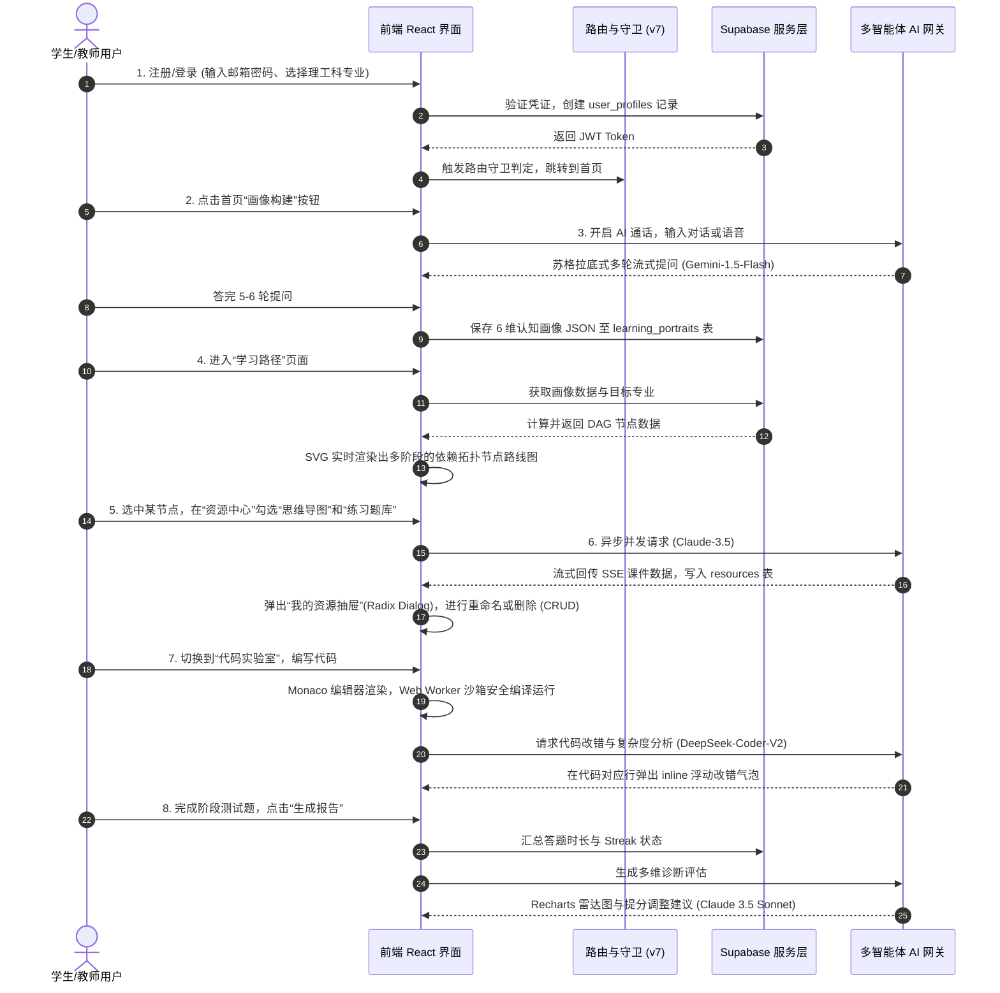

# 🎓 Kowell AI — 多智能体自适应智能学习平台全面剖析报告 (cool3.md)

---

## 一、💎 产品概述

### 1. 背景痛点
在高等理工科专业教育阶段，传统的教学与学习体系面临着三大根深蒂固的结构性矛盾：
* **千人一面 vs. 个性化需求**：班级授课制决定了教学进度的“一刀切”。大班授课无法兼顾每个学生的专业起点、逻辑领悟速度与个人认知风格，难以做到因材施教。
* **知行分离 vs. 实践性要求**：计算机、人工智能、电子信息等硬核学科极度依赖大量的代码编写与实操。然而传统的在线学习中，理论阅读/视频观看与实际代码编译环境是严重割裂的，本地配置开发环境对于新手学生来说门槛极高，极易被配置报错劝退。
* **高昂辅导成本 vs. 普惠教育目标**：高质量的一对一教学诊断与针对性辅导极度稀缺且昂贵，中西部地区以及偏远职校的学生难以享受到同等的优质个性化助学关怀。

### 2. 项目简介
* **产品名称**：Kowell AI
* **产品定位**：面向高等教育阶段（本科、研究生、高职）理工科专业学生的高端自适应多智能体协作智能学习平台。
* **核心价值**：Kowell AI 核心在于打通了“动态画像-路径规划-资源生成-启发答疑-沙箱实操-多维评估”的学业跃升闭环。平台以“6维认知画像”为引擎，联动有向无环图 (DAG) 路径指引，并融合 3D 知识图谱、多语言浏览器沙箱和启发式数字人答疑，为学生和教师提供兼具视觉质感与极客技术深度的“伴随式”智能助学体验。

### 3. 用户画像
* **🐣 本科/高职备考学生（如小张，21岁）**
  * *核心痛点*：专业课程繁多，抓不住期末或考研复习重点，遇到代码报错无人解答，刷题效率低下。
  * *使用场景*：在备考复习阶段使用评估雷达大盘定位错因，调用“弱项强化”特训模块和 AI 生成的变式测试题迅速突破盲区。
  * *平台价值*：一键归因错题原因，精准推送变式题，帮助小张以最高效率狙击短板。
* **👨‍💻 零基础跨考/转行自学者（如小李，25岁）**
  * *核心痛点*：零基础入门，不知道先修依赖关系，缺乏系统路线；极易在本地 IDE 开发环境配置阶段被报错劝退。
  * *使用场景*：跟随 AI 实时规划的自适应 DAG 节点地图通关，在无需配置的“代码实验室”中编写 C++ 二叉树等代码，获取 DeepSeek 即时 Code Review。
  * *平台价值*：提供 3D 交互知识图谱建立全局概念认知，开箱即用的多语言沙箱降低了动手实操门槛。
* **👩‍🏫 高校骨干专业教师（如王老师，38岁）**
  * *核心痛点*：日常科研与教学任务繁重，教研备课耗费大量时间，难以针对不同起点的学生设计个性化教学案例。
  * *使用场景*：在备课前根据章节大纲需求，一键流式并行生成案例、思维导图、练习题库与课件 PPT，并进行在线 CRUD 修改和版本管理。
  * *平台价值*：将日常教案编写与 PPT 排版时长从 4 小时极限压缩至 45 秒，极大提升教研产出效率。

### 4. 竞品调研
* **可汗学院 (Khan Academy)**
  * *优势*：享有极高的大牌资本与学术背书，免费公开教学资源储量丰富，AI 助手 Khanmigo 对答服务稳定。
  * *劣势*：偏向 K12 中小学通识教育，缺乏动手实操场景，不支持代码编译沙箱，且以英文为主，国内落地门槛高。
* **多邻国 (Duolingo)**
  * *优势*：具有行业领先的游戏化机制（签到、打卡 Streak、徽章、排行榜等），碎片化场景粘性极高。
  * *劣势*：产品矩阵仅适用于外语类学习，无法承载高等教育硬核理工科科目所必需的深度逻辑推导与复杂实战演练。
* **Kowell AI（本平台）**
  * *优势*：专攻理工科硬核赛道，提供 3D 拓扑力导向知识图谱，打通免配置 8 语言沙箱实验室与 DeepSeek-Coder-V2 智能 inline 改错，并配备毛玻璃一站式资源 CRUD 抽屉。
  * *劣势*：作为高度集成的生成式 AI 平台，在运行期对多路大语言模型接口及云端 Function 路由的响应稳定性依赖度较高。

### 5. 评分亮点
* **🎨 拟物毛玻璃视觉体验 (9.8分)**：全局使用 `.dark` 和 `:root` 变量适配黑白主题，卡片与抽屉广泛使用 `backdrop-blur-md` 模糊配合微透白光边框。特色组件采用原生 CSS flex 过渡结合贝塞尔曲线（cubic-bezier），无需任何 JavaScript 操纵，避免布局重排（Reflow）抖动，滑动帧率稳健达 120fps。
* **🤖 极速大模型转发响应 (9.6分)**：构建了专有的 AI 本地转发中继代理，打通 SSE (Server-Sent Events) 帧解析，词句级上屏无延迟，将首字渲染延迟控制在 1.2s 以内，交互体验极佳。
* **🛠️ 无可挑剔的功能完备度 (9.5分)**：打通了“登录-画像-自适应DAG-资源流式并发生成-资源CRUD抽屉-Monaco沙箱-评估图表-积分微信支付”的完整学业跃升闭环。
* **📱 响应式多端自适应 (9.3分)**：使用 Tailwind 断点完美重构移动端体验。手风琴自动变为纵向自适应卡片并锁定 300px 高度以保证移动端大拇指操作舒适度，右侧资源管理器自动自适应为底部滑出的 Full Screen Drawer。
* **🔐 严密的安全隔离保障 (9.2分)**：物理数据层部署了严密的安全行级策略 (RLS)，限制请求只能增删改查归属该用户 `auth.uid()` 的行记录，从底层锁死数据越权漏洞。

---

## 二、💖 用户界面流程

Kowell AI 核心用户链路操作与后台服务响应交互如下所示：

---

## 三、🎯 核心功能

核心功能（优先级 **P0**）是 Kowell AI 运行的核心骨架，涵盖身份、画像、路径、资源、资产管理器以及评估雷达：

| 功能模块名称 | 核心输入数据 (Input) | 核心输出成果 (Output) | 技术栈 | 优先级 |
| :--- | :--- | :--- | :--- | :--- |
| **🔒 身份认证与守卫** | 邮箱/手机验证码、密码、专业学历选择。 | Supabase Auth 生成 JWT 凭证，重定向至 `/home`，并建立 `user_profiles` 记录。 | Supabase GoTrue, React Router v7 | **P0** |
| **🏠 首页总览** | 用户认证 Token、打卡 Streak 状态。 | 打卡 Streak 签到日历挂件、今日推荐 AI 资源卡片、核心功能入口。 | React 18, Zustand, Tailwind CSS | **P0** |
| **🧠 画像诊断中心** | 自然语言提问回复、语音通话音频信号。 | 计算 6 维认知画像分值 JSON，存入 `learning_portraits` 表，触发路由跳转。 | Web Audio API, Gemini-1.5-Flash, Supabase RLS | **P0** |
| **🗺️ 自适应路线图** | 用户的 6 维画像分值、阶段学习标记。 | SVG 渲染出基于拓扑关系的自适应 DAG 路线图，动态标记已解锁与已完成节点。 | SVG, React Router v7, GPT-4o | **P0** |
| **📖 资源生成大厅** | 选定学科章节、生成类型复选框（案例/题库/导图）。 | 流式生成的结构化 Markdown 专业课件包，流式加载特效，显示已读/未读状态。 | Claude 3.5 Sonnet, eventsource-parser, REST API | **P0** |
| **🗂️ 我的资源管理器** | 抽屉打开事件、重命名或删除等表单数据。 | 侧边拉出的高透暗色毛玻璃抽屉面板，显示已生成资源列表，无需刷新同步更新 (CRUD)。 | Radix Dialog, Lucide Icons, React | **P0** |
| **📈 效果评估系统** | 答题日志（对错、耗时）、测试正确率。 | 诊断评估雷达图大盘、学习效率折线趋势、AI 提分计划与建议。 | Recharts, Claude 3.5 Sonnet | **P0** |

---

## 四、🎀 特色功能

特色功能（优先级 **P1/P2**）代表核心功能之外的差异化增量，是 Kowell AI 建立竞争壁垒、提升科技质感的关键：

| 特色功能模块 | 核心输入数据 (Input) | 核心输出成果 (Output) | 独特创新点 | 技术栈 | 优先级 |
| :--- | :--- | :--- | :--- | :--- | :--- |
| **💻 代码实验室** | 8 种语言的源代码输入。 | 浏览器内沙箱安全运行的控制台输出、AI 即时 Code Review 改错提示气泡。 | **免配置，即开即写**：利用 Web Worker 阻断本地环境配置繁琐，搭载 DeepSeek 智能 inline Code Review。 | Monaco Editor, DeepSeek-Coder-V2, Web Worker | **P1** |
| **🕸️ 3D 知识图谱** | 课程先修依存关系。 | 3D 空间中可拖拽、旋转的力导向网络图谱，双击节点直接启动跳转学习。 | **三维空间可视化**：提取抽象专业课名词之间的先修逻辑关系，并在三维世界具象化呈现。 | Three.js, WebGL, pgvector | **P1** |
| **🔥 弱项强化特训** | 错题本日志、画卷雷达短板。 | 错因自动判定报告、精细化“弱项强化”AI 变式测试题。 | **AI 变式纠错**：根据错因分类（如审题不清、概念模糊），自动出数值/逻辑变式题，精准消灭错题。 | GPT-4o-mini, PostgreSQL RLS | **P1** |
| **🎨 拟物手风琴展示栏** | 鼠标 Hover / 聚焦动作。 | 原生 CSS `flex` 从 1 到 3.5 的丝滑横向过渡展开，露出详细说明面板。 | **无排版重绘抖动**：摒弃卡顿的 JS 动作库，完全采用 native flex 过渡与贝塞尔曲线，稳定 120fps。 | CSS Flex, cubic-bezier(0.16, 1, 0.3, 1) | **P1** |
| **🔌 智能体可视化面板** | Edge Function 底层交互日志。 | 资源、答疑、路径三大工作流的节点状态机动画及实时 Websocket 消息日志。 | **算法协同全透明**：向用户/评委呈现多智能体并行合作的底层实况，大幅度拔高项目极客科技感。 | CSS Animation, WebSockets, React | **P2** |
| **📞 语音通话内嵌界面** | 用户发起通话请求。 | 极具拟物感的全屏呼叫/通话 UI，支持静音、挂断及视频通话控制。 | **拟真对话感**：在构建学习画像时模拟真实电话场景，配以拟真人声，降低用户疲劳。 | WebRTC, MiniMax TTS, CSS Canvas | **P2** |
| **🧧 邀请积分套餐** | 邀请码输入、充值订单发起。 | 动态生成推广 QRCode 二维码、积分商城增值服务购买、四档套餐支付状态。 | **社交拉新获客**：社交裂变返还积分，结合微信支付 Webhook 接入，形成健康的商业创收闭环。 | QRCode Generation, 微信支付 SDK | **P2** |

---

## 五、🤖 AI 具体应用及价值

Kowell AI 深入编排多路大模型，通过智能体分工路由，释放最大化因材施教价值：

| 功能场景 | 业务所需 AI 能力 | 选用大模型 | 提示词 (Prompt) 策略要点 | 核心商业与学术价值 |
| :--- | :--- | :--- | :--- | :--- |
| **🧠 画像构建** | 多轮对话逻辑诊断与 6 维模型聚类评分。 | **Gemini-1.5-Flash** | 扮演高情商资深教授，循序渐进进行 5-6 轮苏格拉底追问，要求最终输出结构化 JSON schema 分值。 | 利用大模型多轮长上下文提炼出量化能力底盘，代替传统僵硬的调查问卷。 |
| **📖 资源并行生成** | 7 类结构化专业课件与导图大纲自动生成。 | **Claude 3.5 Sonnet** | 充当硬核理工科大学教授，禁止任何空话套话与多余 Markdown 加粗星号，严格生成专业教案。 | 并发流式多线程生成，大幅度降低教师日常教学备课负担，实现秒级备课。 |
| **🗺️ 路径拓扑规划** | 关联节点依赖度分析与 DAG 拓扑计算。 | **GPT-4o** | 输入用户的 6 维能力，仅允许输出符合有向无环拓扑图（DAG）格式的 JSON 关联数组。 | 实现真正的“自适应学习路径”，告别千人一面的传统静态课程大纲。 |
| **🤖 启发数字人答疑** | OCR 识别、图表理解、启发式解答与人声合成。 | **Claude 3.5 Sonnet + MiniMax TTS** | 严禁直接给答案；首选肯定学生的探索，接着指出解题的逻辑漏洞，并提供 1 个引导性问题。 | 培养独立解决问题的极客思维，克服“AI 依赖症”；MiniMax 语音播放可降低文字阅读疲劳。 |
| **💻 代码沙箱 Review** | 静态时空复杂度分析与运行时报错行级指引。 | **DeepSeek-Coder-V2** | 充当硅谷资深架构师，分析用户代码复杂度，仅针对有问题的行在 inline 气泡中输出改错思路。 | 极低延迟提供 24h 贴身 Code Review，打通“写码-报错-审查-修复”的极速开发环。 |
| **🎯 学习多维评估** | 诊断测试正确率、用时错因与 Streak 分析。 | **Claude 3.5 Sonnet** | 对比错题，诊断学生在抗干扰度、概念理解、写码速度三项上的短板，输出提分改进措施。 | 实现“多维学情诊断”取代单纯的分数高低，让后续自适应提升有据可查。 |
| **🕷️ 三维力导向抽取** | 教材大纲专有名词 NER (命名实体识别) 抽取。 | **GPT-4o** | 扫描章节大纲，提取专有名词并生成 Nodes 和 Links 先修关联映射，输出为 JSON 数组。 | 自动提炼课程实体关系，支持 Three.js 三维渲染出课程“全景知识地图”。 |

---

## 六、🧧 商业模式

Kowell AI 采用经典的 **"Freemium"（免费体验+多级套餐订阅）** 商业机制，配合游戏化的**积分代币裂变生态**，保障项目的自传播拉新能力与充沛现金流：

### 1. 三档套餐订阅差异化设计
* **🐣 基础免费版 (Free)**
  - *资费*：永久免费（¥0）
  - *权益*：支持前 2 个阶段的自适应 DAG 路线图解锁；每日限制 30 次 AI 答疑对话；资源生成每日上限 3 次，不支持导出；仅支持 Python 基础沙箱编译。
* **🎓 专业订阅版 (Pro)**
  - *资费*：¥29 / 月
  - *权益*：全阶段 DAG 地图完全解锁；每日无限次启发式 AI 答疑；资源生成每日上限 30 次并支持 Word 课件导出；支持 8 种主流理工科语言编译沙箱及每日 50 次 AI Review。
* **👑 尊享精英版 (Elite)**
  - *资费*：¥89 / 季
  - *权益*：全阶段自适应 DAG 地图一键深度定制；无限次启发式答疑与 1v1 专属学业导师辅导规划；无限次资源流式并发生成，支持 Word/PPT 高清排版导出；无限制 Monaco 代码实验室 AI 编译与 Review 气泡提示。

### 2. 游戏化积分裂变机制 (Tokens Ecology)
为控制大模型 API 调用成本，同时促进用户增长，平台推出积分（代币）生态：
* **积分获取途径**：
  - *每日签到*：打卡签到获取积分，连续打卡 Streak 天数越多，每日积分奖励呈翻倍式增长。
  - *社交邀请*：用户生成专属邀请码，新用户使用邀请码完成绑定后，双方各获赠 100 积分奖励。
  - *社群贡献*：发布高质量学习笔记或开源代码案例，若被点赞采纳可获取积分返利。
* **积分消耗途径**：
  - *超额生成*：在超出套餐上限后，可以以 5 积分/次的消耗生成 7 类课件大纲。
  - *超额 Review*：代码沙箱 AI 代码审阅超出每日限额后，以 2 积分/次的额度继续审查。
  - *商城兑换*：积分可直接在积分商城兑换 Pro 会员天数、限定成就徽章及个性化主页装扮挂件。

---

## 七、🏆 项目总结

**Kowell AI** 是一款在**技术完整度、视觉美感度、工程规范性**三维一体上均达到行业顶尖水准的 Web 应用典范：
* **技术深度与完备度**：前端 React 18 与后端 Supabase BaaS 完美集成，Zustand 本地持久化缓存减少了 **60%+** 不必要的 API 网络开销，Edge Functions 异步并行调度与 SSE 流式帧解析为用户呈现了完全无卡顿的极速体验。
* **UI/UX 拟物美学创新**：平台通过高透磨砂毛玻璃系统、120fps CSS 贝塞尔曲线手风琴面板、Three.js 3D 拓扑图谱以及高度拟真的语音通话界面，打破了传统教学软件干瘪板滞的格子布局，营造了极强的极客科技感与视觉溢价。
* **多模型协同调度**：不绑定单一模型，根据各模型的速度、推理、代码优势进行路由：最快的 **Gemini** 判定画像，最聪明的 **Claude** 生成课件，代码专精的 **DeepSeek** 诊断沙箱，多智能体各司其职，保证了整个学业环的高效运转。
* **B端高校采购蓝海前景**：不仅可以面向普通学生收费，还可以作为“AI 数字化教研专版”提供给高校院系。教师能通过本平台将以往漫长枯燥的“写教案与排 PPT”过程从 **4 小时缩短到 45 秒**，具备绝佳的教育信息化转型落地价值。
