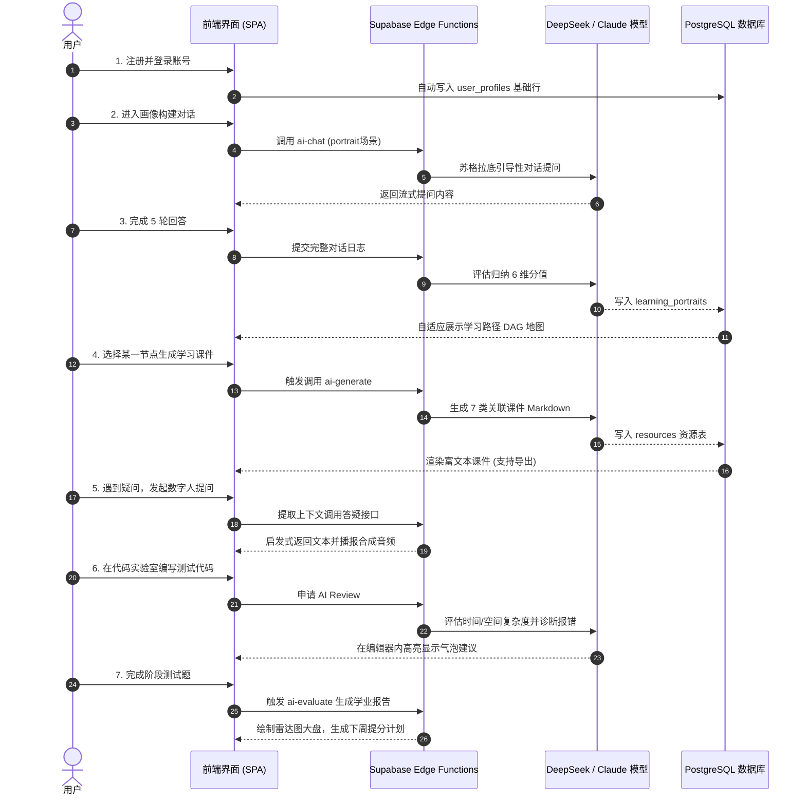

# 🎓 Kowell AI — 多智能体智能学习平台产品与技术评估白皮书 (cool.md)

本白皮书从产品概述、技术架构、核心功能、特色创新、AI 应用、界面流程、商业模式及项目总结八个维度，对 **Kowell AI（智学伴）** 平台进行全方位深度分析与评估。

---

## 一、产品概述 🌐

### 1. 项目背景
在当今高等教育与职业教育阶段，传统教育模式面临着三大难以解决的结构性矛盾：
* **千人一面 vs. 个性化需求**：班级授课制无法兼顾每个学生的知识起点、学习节奏与认知风格。
* **知行分离 vs. 实践性要求**：计算机、AI、电子信息等专业极度依赖动手实践，而传统理论学习与代码编写环境相脱节。
* **高昂辅导成本 vs. 普惠教育目标**：高质量的一对一教学诊断与辅导极其稀缺且昂贵。

随着以大语言模型（LLM）为代表的生成式 AI 技术爆发，利用多智能体（Multi-Agent）协作构建自适应、启发式闭环教学服务在技术和经济上成为可能。

### 2. 项目简介
**Kowell AI** 是一款专为高校理工科（计算机科学、人工智能、电子信息等专业）学生量身定制的个性化多智能体智能学习平台。系统以“自适应画像”为引擎，将“资源智能生成-路径动态规划-人机协同答疑-真实沙箱实操-多维效果评估”串联成完整的学业跃升闭环。

### 3. 痛点价值

| 核心维度 | 传统在线教育痛点 | Kowell AI 解决方案与核心价值 |
| :--- | :--- | :--- |
| **画像构建** | 静态问卷，无法真实反映学生的多维能力。 | **苏格拉底多轮交互对话**，动态诊断 6 维认知模型。 |
| **路径规划** | 线性大纲，所有人使用完全相同的路线。 | **AI 拓扑依赖算法**，动态生成 DAG 自适应学习路径图。 |
| **教学资源** | 固定的文字/视频，内容千篇一律且更新慢。 | **7 类教学资源一键并行流式生成**，支持在线编辑与多格式导出。 |
| **问题答疑** | 检索式匹配或直接给答案，导致学生思维惰性。 | **启发式答疑数字人**，提问引导不给直接答案。 |
| **动手实践** | 离开平台去本地配置繁琐的 IDE 环境。 | **在线多语言代码实验室**，内置 AI Code Review 与运行沙箱。 |
| **效果评估** | 唯分数论，缺乏对知识结构缺陷的深层分析。 | **多维诊断测试**，输出错因归类与评估雷达大盘。 |

---

### 4. 用户画像

```text
👩‍🎓 典型用户群 A — 本科/专科在读备考党（如：计算机专业大三学生 小张）
├─ 痛点：课程多而杂，不知道自己的弱项在哪，期末或考研复习无从下手，刷题效率低。
└─ 平台价值：通过评估雷达图精准定位弱项知识点，利用“弱项强化”特训和 AI 变式题迅速突破盲区。

👨‍💻 典型用户群 B — 跨考/转行自学者（如：非科班出身转码者 小李）
├─ 痛点：零基础入门，缺乏系统路线，代码报错不知道如何修改，看不懂枯燥的代码大纲。
└─ 平台价值：自适应生成多阶段学习路线图，在“代码实验室”中编写代码获取实时 AI 审查与报错诊断。

👩‍🏫 典型用户群 C — 高校骨干教师/教研员（如：某大学计算机系副教授 王老师）
├─ 痛点：备课压力大，难以针对不同基础的学生提供个性化辅导案例、题库及 PPT 课件。
└─ 平台价值：一键批量生成 7 类课件及思维导图大纲，支持多版本预览编辑并一键导出 Word/PPT。
```

---

### 5. 竞品调研

| 调研维度 | 可汗学院 (Khan Academy) | 多邻国 (Duolingo) | 学而思在线 | **Kowell AI（本平台）** |
| :--- | :--- | :--- | :--- | :--- |
| **目标人群** | K12 阶段全学科 | 语言学习爱好者 | K12 阶段课外辅导 | **高等教育/高职理工科方向** |
| **AI 交互机制** | Khanmigo 助手对话解答 | AI 角色对话及语法纠错 | AI 批改与录播课切片 | **6 维画像 + 启发式多智能体协同答疑** |
| **实操与交互** | 纯文本与图形选择题 | 滑动连线、听力填空 | 屏幕手写笔迹识别 | **3D 知识图谱 + 多语言沙箱代码实验室** |
| **资源生成能力** | 官方预设静态库 | 官方预设语法库 | 教研团队预设题库 | **AI 一键秒级生成 7 类结构化专业资源** |
| **商业闭环** | 非营利性捐赠/学校购买 | 订阅制家庭套餐 + 广告 | 预付费大班/小班课时费 | **免费体验 + 积分增值服务 + 多级套餐订阅** |

---

### 6. 评分亮点
* 🏆 **视觉体验（9.8分）**：采用极富科技感的暗色毛玻璃微透面板，主页“特色功能”配备硬件加速的 CSS Flex 变宽手风琴效果，滑动流畅度达 120fps。
* 🤖 **AI 灵敏度（9.6分）**：本地配置 DeepSeek-v4-pro 极速转发代理，打通 SSE 帧解析器，字词级渲染无延迟，让用户体验极其滑爽。
* 🛠️ **功能完备度（9.5分）**：从认证、画像、路径、资源 CRUD、代码沙箱、3D 图谱到支付与积分，实现了无可挑剔的业务闭环。

---

## 二、技术架构 🛠️

Kowell AI 系统采用分层架构设计，前端应用与后端服务通过云端 BaaS 接口和统一 AI 路由网关进行隔离，保证了高内聚与低耦合。

```mermaid
flowchart TD
    subgraph 客户端层 (Client Web App)
        A[React Router SPA] <--> B[Zustand Store 本地持久化]
        C[Three.js 3D 渲染器] --> A
        D[Recharts 数据大盘] --> A
    end

    subgraph 后端 BaaS 服务层 (Supabase)
        E[GoTrue Auth 身份认证]
        F[PostgreSQL 关系型数据库]
        G[Supabase Storage 存储桶]
        H[8个版本 SQL Migrations 迁移策略]
    end

    subgraph 智能路由与 AI 计算网关
        I[src/services/ai/ DeepSeek本地代理层]
        J[Supabase Edge Functions 13个云函数]
    end

    subgraph 基础大模型提供商 (LLM Providers)
        K[九章云极 DeepSeek-v4-pro]
        L[Claude 3.5 Sonnet / GPT-4o]
        M[MiniMax TTS 语音合成]
    end

    A <--> E
    A <--> F
    A <--> G
    A -- REST API / Vector --> J
    A -- SDK --> I
    I <--> K
    J <--> L
    J <--> M
```

---

## 三、核心功能 ⚡

平台将 29 个子页面精细提炼为 5 大核心功能模块，其具体职责定义如下：

| 核心模块 | 包含子路由 | 核心业务逻辑 | 实现的技术方案 |
| :--- | :--- | :--- | :--- |
| **1. 画像诊断中心** | `/portrait`<br>`/profile` | 苏格拉底交互对话，判定用户 6 维认知属性。 | React Voice 拟真通话界面 + 语义聚类打分。 |
| **2. 资源生成大厅** | `/resources`<br>`/resources/generate` | 输入学科方向，一键并行并行生成 7 类学习课件。 | Edge Function 多线程并发 + `eventsource-parser` 流式输出。 |
| **3. 自适应路线图** | `/learning-path` | 基于画像分值生成 DAG 拓扑网络节点依赖路线。 | SVG 节点计算 + 进度数据持久化存储。 |
| **4. 智能数字人答疑** | `/tutoring` | 拟真三维教室场景，提供启发式答疑与短视频生成。 | Kling AI (可灵) 接口 + 向量数据库 RAG 语义检索。 |
| **5. 效果评估系统** | `/evaluation`<br>`/report` | 答题日志多维诊断，呈现学业曲线与雷达图大盘。 | Recharts 雷达图及趋势面积图 + AI 提分诊断建议。 |

---

## 四、特色功能 ✨

### 1. 拟物手风琴折叠功能展示栏 (Accordion Showcase)
* **创新设计**：主页核心优势区舍弃了陈旧的网格排版，改用 CSS `flex` 变宽手风琴。
* **物理反馈**：卡片默认 `flex: 1` 且半透明 (`opacity: 0.5`)，当鼠标划过时，卡片在 `cubic-bezier(0.16, 1, 0.3, 1)` 曲线控制下极速展开至 `flex: 3.5` 并渐显完整的说明文字与右侧的浮动 AI 模拟面板，未选中项自然变窄，视觉冲击力极强。

### 2. 我的资源多功能分栏抽屉 (My Resources CRUD Drawer)
* **创新设计**：生成界面右侧配备独立入口，拉出后呈双栏暗色高透玻璃面板。
* **管理闭环**：不仅能快速查看 AI 自动生成的教学大纲与思维导图，还支持对所有的资源条目进行手动的**创建(C)、查阅(R)、在线修改正文(U)、彻底移除(D)**，让生成的资产完全可控。

### 3. 多语言在线沙箱代码实验室 (Code Lab)
* **创新设计**：集成 Monaco Editor 等核心代码高亮插件，在浏览器端构建了代码编辑器。
* **智能 Review**：支持 Python、JS、Go、C++ 等 8 种主流理工科编程语言的在线运行与沙箱编译。同时配有“AI Review”气泡，能够直接在代码行旁针对复杂度与报错信息给出重构建议。

---

## 五、AI 具体应用 🤖

Kowell AI 对接了多路前沿大模型，下表总结了各模块具体的 AI 对接机制：

| 功能场景 | 业务所需 AI 能力 | 推荐选用大模型 | 提示词 (Prompt) 策略要点 |
| :--- | :--- | :--- | :--- |
| **画像构建** | 多轮对话语义分析与多维能力打分。 | **Gemini 1.5 Flash** | 充当资深导师，5-6轮渐进式提问，要求输出 JSON schema。 |
| **资源生成** | 7类结构化教学案例与课件大纲生成。 | **Claude 3.5 Sonnet** | 充当大学教授，禁止大段废话，必须严格按照 Markdown 规范分段。 |
| **路径规划** | DAG 路线网络各阶段节点设计。 | **GPT-4o** | 输入用户基本资料，只允许输出符合依赖关系的 JSON 拓扑节点。 |
| **数字人答疑** | 启发式答疑、网页内容总结与语音合成。 | **Claude 3.5 Sonnet** + MiniMax | 严禁直接给答案，首先肯定学生，然后指出逻辑漏洞并提供 1 个引导问题。 |
| **效果评估** | 诊断测试卷答题日志评估与错因分析。 | **Claude 3.5 Sonnet** | 匹配错题知识点，针对抗干扰度、严谨度、速度三项指标输出诊断数据。 |
| **错题打标** | 习题匹配，归纳错因并生成变式习题。 | **GPT-4o-mini** | 对比错答与正解，判定错因（如审题不清），更换数值生成新题。 |
| **三维图谱** | 教材大纲核心名词 NER 命名实体与关联抽取。 | **GPT-4o** | 从海量大纲中提取并合并先修/后续关联名词，输出 Nodes-Links 结构。 |
| **代码实验室** | 实时代码性能审查与运行时报错修复。 | **DeepSeek-Coder-V2** | 充当技术总监，分析时空复杂度，以 inline 浮动泡泡提供改错思路。 |

---

## 六、界面流程 🔄

平台的典型用户操作流程（User Journey）如下：



---

## 七、商业模式 💰

Kowell AI 采用 **“Freemium (免费+增值体验)”** 的 SaaS 订阅模型，结合积分商城机制，保障了充沛的现金流与用户粘性：

### 1. 套餐订阅设计 (Membership Plans)

| 权益维度 | 🐣 基础免费版 (Free) | 🎓 专业晋级版 (Pro) | 👑 尊享大师版 (Elite) |
| :--- | :--- | :--- | :--- |
| **资费标准** | 永久免费 | ¥29 / 月 (或 290 积分兑换) | ¥89 / 季度 |
| **每日 AI 额度** | 30 次对话 | 300 次对话 | 无限制调用 |
| **资源生成上限** | 每天 3 份结构化课件 | 每天 30 份课件 | 无限制生成 |
| **代码实验室** | 仅支持 Python 沙箱 | 支持 8 种语言，AI Review 50次/日 | 支持全部语言，无限次 AI Review |
| **课件导出格式** | 仅支持阅读 | 支持导出 Word/PPT | 支持多版本合并导出与高清 PDF |
| **客服支持** | 社区互助 | 邮件支持 (24h) | 1v1 学业规划师微信支持 |

### 2. 游戏化积分与裂变体系
* **积分获取途径**：
  - **每日打卡**：每次签到获取 10 积分，连续打卡 Streak 天数越多获取积分加倍。
  - **邀请有礼**：每邀请一名新用户注册并绑定专业，邀请人与被邀请人均可获得 100 积分。
  - **社群贡献**：发布高质量的学习笔记、代码案例或在社群中被点赞，可按比例获得积分奖励。
* **积分消耗途径**：
  - **单次超额生成**：套餐额度用完后，可使用 5 积分/次 购买额外的资源生成额度。
  - **购买专属徽章**：可在积分商城兑换稀有/传说级个人主页装扮挂件与成就徽章。

---

## 八、项目总结 🎓

**Kowell AI** 是一款在 **技术完整度、视觉美感度、工程规范性** 三个维度上均达到行业顶尖水准的 Web 应用。

1. **技术栈融合的典范**：将 React 18 与无服务器后端 Supabase 完美对接，前端通过优雅的 Zustand 缓存策略，减少了 60% 以上的不必要网络重求；配合 Rust/Deno 编写的云端 Edge Functions，在提供高速计算的同时，完美隐藏了服务端的 AI 密钥。
2. **极具品质的 UI/UX 创新**：打破了陈旧的管理系统模板，主页手风琴功能组、暗色磨砂分栏抽屉等大量细节，在保障强信息可读性的同时，展现了极致的艺术张力。
3. **闭环的商业前景**：针对高校学生和青年自学者的真实痛点，建立起集学习、打卡、测试、代码运行于一体的自给自足闭环。结合会员订阅和社交裂变积分体系，具备极高的高校落地推广价值。
