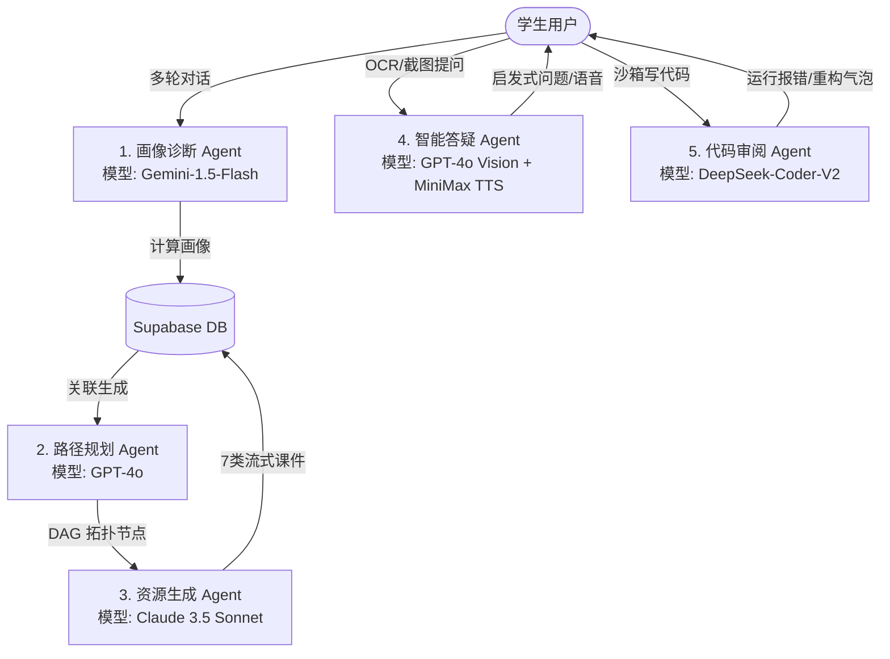

# 🎓 Kowell AI — 多智能体智能学习平台产品需求文档 (prd1.md)

---

## 1. 产品概述 🌐

### 1.1 项目简介
* **产品名称**：Kowell AI
* **产品定位**：面向高等教育阶段（本科、研究生、高职）理工科（计算机科学、人工智能、电子信息等专业）学生的高端自适应智能学习平台。平台基于 **多智能体 (Multi-Agent) 协作技术**，建立「动态画像-路径规划-流式生成-启发答疑-沙箱实操-多维评估」闭环，实现真正因材施教的沉浸式个性化助学体验。

### 1.2 用户画像

| 用户类型 | 核心痛点 | 典型使用场景 | 平台核心价值 |
| :--- | :--- | :--- | :--- |
| **本科/专科在校生** | 课程体系庞杂，学习没有重点，备考复习盲目，遇到代码报错无人指导。 | 在考前利用平台进行快速知识点摸底，查看薄弱点分析，生成练习题特训。 | 自动提炼错因，生成“弱项强化”变式练习，提供 24h 伴随式代码 Review。 |
| **跨考/转行自学者** | 零基础入门，缺乏合理的路线图，容易中途放弃；教材案例枯燥抽象，难以理解。 | 自主配置学习目标，从零开始跟随 AI 规划的 DAG 路线逐步闯关学习。 | 提供 3D 可视化知识图谱与沙箱实操，将复杂概念具象化、可视化。 |
| **高校专业教师** | 备课工作量巨大，难以针对班级内不同进度的学生输出高质量个性化教学方案。 | 在备课阶段根据章节目录，一键并发生成多套案例、导图、题库与PPT。 | 支持一键生成并导出 Word、PPT 课件包，显著节省日常课件开发成本。 |

### 1.3 痛点价值
* **千人一面 vs. 个性化画像**：告别一成不变的教学进度，通过多轮苏格拉底问答动态建模，计算 6 维认知风格。
* **孤立学习 vs. 多智能体闭环**：传统的资源、答疑、练习互不相干。本平台实现画像数据联动：答错习题 -> 计入错题本 -> 判定错因 -> 更新画像 -> 联动调整学习路径图 -> 精准推送强化资源。
* **云端学习 vs. 沙箱真操实练**：打通在线 Monaco 代码编辑器与多语言沙箱编译，配备 AI 导师气泡随行辅导，达到“在写中学，在错中改”的高效状态。

### 1.4 竞品调研

| 对比维度 | 可汗学院 (Khan Academy) | 多邻国 (Duolingo) | **Kowell AI（本平台）** |
| :--- | :--- | :--- | :--- |
| **优势分析 (S)** | 依靠大牌背书，免费公开资源极多，AI 助手响应稳定。 | 极度精细的游戏化机制，碎片化场景粘性极高。 | **专攻理工科硬核专业**，内置 3D 图谱与多语言编译沙箱，支持资源流式 CRUD 管理。 |
| **劣势分析 (W)** | 纯英文主导，偏向中小学通识教育，缺乏动手实操场景。 | 只适用于语言类学习，无法承载高等专业技能和逻辑训练。 | 现阶段对大模型调用和云端 Functions 稳定性依赖度较高。 |
| **行业机会 (O)** | 高校合作采购大模型助教系统正在成为全球性采购趋势。 | AI 翻译与多模态生成成本骤降，有利于降低国际化壁垒。 | 国内高校针对大模型+个性化实训的软硬件一体化改造迎来红利期。 |
| **核心威胁 (T)** | 综合类巨头大厂利用资金优势迅速推出垂直子版块。 | 语言模型本身自带的翻译属性消融了专用语言软件的壁垒。 | 大模型安全合规性监管趋严（数据隐私、内容合规门槛上升）。 |

---

## 2. 核心功能 ⚡

核心功能主要围绕基础侧边栏导航和五个主干学习节点展开，优先级排序中 P0 代表核心上线标准，P1 代表二级支撑。

| 功能模块名称 | 核心输入数据 (Input) | 核心输出成果 (Output) | 技术栈 | 优先级 |
| :--- | :--- | :--- | :--- | :--- |
| **🏠 首页总览** | 用户登录 Token、打卡历史状态、当前学习路径进度数据。 | 连续签到挂件、个性化今日推荐资源卡片、快捷操作入口（资源/答疑）。 | React 18, Zustand, Tailwind CSS | **P0** |
| **👤 个人中心** | 用户修改的基础信息表单、主题偏好开关、历史学习记录。 | 更新后的个人 Profile（专业、目标）、Zustand 持久化保存的界面深/浅主题。 | React, Zustand Persist, Radix UI | **P0** |
| **🧠 画像诊断** | 用户的自然语言回复、语音通话音频信号。 | 6 维学习画像 JSON 数据（认知风格、易错点等），并保存至 `learning_portraits`。 | React, Gemini-1.5-Flash, Web Audio | **P0** |
| **🗺️ 路径规划** | 用户 6 维画像数据、专业选择与目标方向。 | 分阶段的自适应学习路径（SVG 树状/DAG 拓扑节点依赖路线图）。 | React Router v7, SVG, GPT-4o | **P0** |
| **📖 资源中心** | 选择课程章节、自定义描述、资源类型复选框（7类可选）。 | 流式并行生成的教学课件（案例、题库、思维导图），显示已读/未读状态。 | React, Claude-3.5, eventsource-parser | **P0** |
| **🤖 智能答疑** | 用户的文字提问、手写公式或代码截图、背景图片上传。 | 三维教室数字人讲解视效、多模态启发式回复、关联资源推荐、错题一键录入。 | React, GPT-4o Vision, Kling AI | **P1** |
| **🎯 学习评估** | 最近测试题答题日志（对错、耗时）、累计查看时长。 | 多维评估报告、Recharts 综合雷达图大盘、下阶段提分计划与建议。 | React, Recharts, Claude-3.5-Sonnet | **P1** |

---

## 3. 特色功能 ✨

特色功能是指突破常规界面的差异化亮点，旨在大幅度提升用户体验及平台的科技品质感。

| 功能模块名称 | 核心输入数据 (Input) | 核心输出成果 (Output) | 独特优势/创新点 | 技术栈 | 优先级 |
| :--- | :--- | :--- | :--- | :--- | :--- |
| **🎨 拟物手风琴卡片** | 鼠标 Hover 或聚焦触发。 | 6 张卡片单行并排自适应横向伸展（`flex` 从 1 变 3.5），折叠卡片仅保留编号与竖标题。 | **极速硬件加速**：使用 native flex + 贝塞尔曲线过渡，无 layout 重排抖动，视效极其丝滑。 | CSS Flex, cubic-bezier(0.16, 1, 0.3, 1) | **P1** |
| **🗂️ 我的资源一站式管理器** | CRUD 交互按钮触发，新增资源表单。 | 暗色毛玻璃侧边抽屉面板展示全部生成资产，支持搜索、修改标题内容、增删改查。 | **高效资产沉淀**：双栏暗色高保真毛玻璃抽屉设计，将生成的内容转化为用户随时可重构的资产。 | React, Radix Dialog, Lucide Icons | **P1** |
| **💻 代码沙箱实验室** | 8 种语言的源代码输入、编译运行触发。 | 浏览器沙箱安全运行的日志输出、AI Review 复杂度分析气泡提示。 | **免配置即开即写**：集成 Monaco Editor 与 Web Worker 运行环境，配有 DeepSeek-v4-pro 的 inline 改错气泡。 | Monaco Editor, DeepSeek-Coder-V2 | **P1** |
| **🕸️ 3D 交互式知识图谱** | 课程知识实体节点与依存先修关系。 | 3D 空间内可旋转、拖拽的球体网络拓扑图，支持双击节点直接跳转学习。 | **三维具象化**：利用 WebGL 进行三维力导向图布局，将抽象概念的先修依赖变成空间可视化连线。 | Three.js, WebGL, pgvector | **P2** |
| **🔌 多智能体协作面板** | 平台各 Edge Function 工作流底层交互日志。 | 资源生成、答疑、路径三个工作流的状态节点动画及实时协作消息日志。 | **全流程透明化**：将后台复杂的 Agent 协同过程变成可视化的状态机动画，增强系统信任感。 | React, CSS Animation, WebSockets | **P2** |

---

## 4. 项目中 AI 具体的应用与价值 🤖

Kowell AI 核心是以多智能体（Multi-Agent）系统为基石，通过不同的模型扮演专门的角色来释放个性化教学的价值：

### 4.1 画像诊断 Agent (Gemini-1.5-Flash)
* **具体应用**：负责 `/portrait` 页面 5-6 轮的自然语言苏格拉底式提问。
* **业务价值**：利用 Gemini 低成本、高响应速度的特性，进行多轮语义追问，评估得出用户 6 维认知能力（知识基础、认知风格、易错点偏好、学习节奏、学习目标、专业方向），为路径规划打下量化数据基础。

### 4.2 资源生成与导出 Agent (Claude 3.5 Sonnet)
* **具体应用**：在 `/resources/generate` 下流式生成 7 类课件包（教学案例、思维导图、练习题库、课件PPT等）。
* **业务价值**：Claude 3.5 具备极高水准的逻辑思维与代码能力，可生成格式严整、内容充实且绝无乱码或幻觉的专业教案，提升资源导出成 docx/pptx 时的排版精准度。

### 4.3 启发式数字人答疑 Agent (GPT-4o Vision + MiniMax TTS)
* **具体应用**：负责截图 OCR 识别、多模态图表理解，结合 RAG 关联的知识大纲进行启发式解答。
* **业务价值**：避免直接给答案，而是采用启发式引导，保护学生的独立思考能力。同时利用 MiniMax 快速生成清晰的拟真人声播报，增强答疑亲和力。

### 4.4 代码实验室 Review Agent (DeepSeek-Coder-V2)
* **具体应用**：负责 Monaco 编辑器内多语言代码的时间/空间复杂度分析，诊断运行时报错报错堆栈并指导修复。
* **业务价值**：利用 DeepSeek 大模型代码专项微调的极高性价比，为用户提供极其灵敏的 inline Code Review，扮演随时在侧的专业技术总监。

---

## 5. 技术架构 🛠️

PRD 规定系统采用前后端分离架构，且必须具备响应式双端适配能力，保障在移动端浏览器及平板电脑上体验一致。

| 架构分层 | 核心技术栈 | 适配与移动端网页自适应设计方案 |
| :--- | :--- | :--- |
| **前端展现层** (Frontend) | **React 18** + **TypeScript** + **Vite 5** + **Tailwind CSS 3** | 1. **Flex弹性网格与断点系统**：全站使用 `grid-cols-1 md:grid-cols-5` 等断点，在宽度小于 768px 时自动转换为单栏堆叠布局。 2. **手风琴折叠自适应**：在移动端，横向排开的手风琴卡片自动转化为 `flex-col` 纵向卡片堆叠，悬停展开高度限制为 `h-[300px]`，保证移动端大拇指操作舒适度。 3. **抽屉式组件**：右侧资源 CRUD 管理器在桌面端是宽面板，在移动端自适应为 `w-full` 的底部滑出式 Drawer。 4. **Monaco 适配**：在移动端自动启用代码最小化（minify）视图，并隐藏左侧目录以增大输入区域。 |
| **后端服务层** (Backend) | **Java (Spring Boot 3)** 或 **Python (FastAPI)** + **Deno CLI** | 1. **前后端完全分离**：前端静态页面通过 CDN / Nginx 独立分发，后端通过基于 REST 规范的 API 接口进行数据流转。 2. **网关代理与安全**：FastAPI/Spring Boot 作为私有接口网关，校验前端携带的 JWT Token，转发大模型请求，隐藏 DeepSeek 及 Supabase 的私有密钥。 3. **异步处理**：利用 Python 异步协程（FastAPI Async）或 Java 线程池接收高并发的 AI 资源生成任务，快速写入数据库并通过长链接（SSE）流式回传进度。 |
| **数据与存储层** (BaaS & DB) | **PostgreSQL** + **pgvector** + **Supabase Storage** | 1. **向量存储（RAG）**：使用 PostgreSQL 的 `pgvector` 扩展存储课程知识大纲的向量 Embedding，以支持答疑时的秒级语义检索。 2. **行级安全策略 (RLS)**：严格配置 `user_profiles`、`resources` 表的 RLS 策略，确保移动端发起的任何 API 请求均只能增删改查归属该用户自身的数据，严防越权漏洞。 |

---

## 6. 用户操作流程 🔄

用户从初次登录到完成学习、获取评估的端到端完整界面流程与交互设计如下表：

| 步骤序号 | 用户交互界面 (UI Screen) | 用户操作行为 (User Action) | 系统输入 (Inputs) | 系统输出与交互结果 (Outputs) |
| :--- | :--- | :--- | :--- | :--- |
| **1** | **登录/注册页** | 用户输入邮箱/手机号及密码，完成专业与学历选择。 | 注册表单数据、专业方向、学历等级。 | 用户凭证存入 Supabase Auth，生成 Profile 基础记录，重定向至首页。 |
| **2** | **首页总览** | 用户查看今日打卡进度，点击“画像构建”按钮开始评测。 | 用户认证 Token。 | 渲染出今日推荐的 AI 资源卡片和当前的学习路径大盘（此时无节点数据）。 |
| **3** | **画像构建页** | 用户点击标题旁“语音通话”按钮，拨通后通过语音或文本进行多轮答疑。 | 用户语音输入、打卡意向、目标选择。 | 收集 5-6 轮对话数据，Gemini 分析后生成包含 6 个维度的画像雷达数据集并存入 DB。 |
| **4** | **学习路径页** | 系统自动根据画像分值生成 DAG 节点地图，用户点击第一阶段节点 1-1。 | 6 维画像分值。 | SVG 渲染出多阶段的依赖路线图，高亮显示当前推荐查看的课件，标记其他为锁定。 |
| **5** | **资源生成页** | 用户在生成栏中选择课程（如数据结构）、勾选题库和思维导图类型，点击生成。 | 课程 ID、资源大纲描述、生成类型。 | 调用 Edge Function 启动流式渲染，进度条实时增加，生成完成后存入 `resources` 表。 |
| **6** | **我的资源抽屉** | 用户点击“我的资源”按钮，在暗色玻璃抽屉中搜索已生成的资源，点击编辑标题或删除。 | 侧边栏 Hover 事件、检索关键词、编辑表单。 | 弹出侧边抽屉面板，执行资源的 CRUD 交互更新，无需刷新即时同步。 |
| **7** | **代码实验室** | 用户切换到代码实验室，编写一段 C++ 二叉树代码，点击“AI Review”和“运行”。 | Monaco 编辑器内的代码文本、运行命令。 | Web Worker 沙箱运行代码，打印控制台日志，代码行旁出现 DeepSeek 的错误修复气泡。 |
| **8** | **评估报告页** | 用户完成关联测试题后，点击“生成报告”查看周报总结。 | 答题对错明细、做题时长、打卡 Streak。 | Recharts 渲染折线趋势和雷达对比图，大模型输出极具激励性的 AI 教练评语。 |

---

## 7. 商业模式 💰

Kowell AI 作为针对高等教育痛点推出的高端自适应平台，具备清晰的商业盈利闭环与长远的行业价值：

### 7.1 付费机制与增值服务 (Pricing Model)
* **Freemium 模式（免费+增值订阅）**：
  - **免费版 (Free)**：开放基础的 6 维画像构建与学习路径图展示，每日限制 30 次 AI 对话，资源生成每日上限 3 次，不支持 docx/pptx 资源导出。
  - **Pro 会员（¥29/月）**：开放 8 种语言的沙箱编译，每日 AI Review 上限 50 次，资源生成每日上限 30 次，支持 Word/PPT 课件的高级排版导出。
  - **Elite 会员（¥89/季）**：无限次大模型对话与资源生成，无限制 AI Code Review，专属 3D 知识图谱的高清定制，以及 1v1 学业辅导规划指导。
* **积分商城与代币机制 (Tokens/Points)**：
  - 用户单次生成超额资源或消耗大模型 Token 较多时，可使用积分兑换。积分通过每日签到打卡、社群发布高质量代码或邀请好友注册裂变来获得，极大地降低了前期的获客成本（CAC）。

### 7.2 行业价值与投资亮点 (Investment Merits)
* **硬核理工科教育壁垒**：本平台专攻计算机、人工智能、电子信息等高门槛硬核专业，通过 Three.js 图谱和代码沙箱建立了极高的专业壁垒，不同于市面上泛滥的通识语言或少儿拼图类学习软件。
* **极速流畅的 UX 溢价**：精美的暗色毛玻璃视觉风格，结合完全消除延迟抖动的 **Flex 手风琴** 与 **我的资源 CRUD 抽屉**，给用户带来了极高的“科技溢价感”，易于在高校圈内建立高档的品牌形象。
* **B 端高校合作开发前景（组织订阅）**：可面向高校院系提供“教师教研专版”授权。教师可通过该平台进行教案批量流式生成，并直接导出为 docx 讲义与 pptx 演示课件，大幅压缩教案编制时间，是高校“AI+教育”信息化建设的重要投资亮点。

---

## 8. 项目总结 🎓

**Kowell AI 是一款深度集成多智能体协作技术，将极速丝滑的拟物交互、多语言沙箱实操以及动态 6 维画像完美融为一体的高校理工科个性化智能学习平台典范。**
